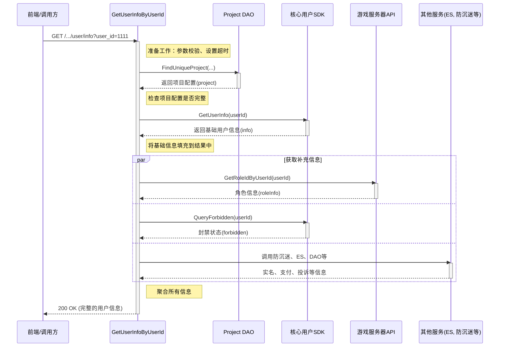

# Learning Notes of Advanced Golang Programming

## Concurrency Overview

这边主要是区分三个概念：

- 进程：操作系统分配资源的基本单位
- 线程：操作系统调度资源的基本单位
- 协程：可以理解为用户态线程，协程的调度在用户态进行，不需要切换到内核态；所以不需要由操作系统参与，而是由用户自己控制；

### 并发与并行

并行模式：两个任务一直运行，而且是同时运行着（同一时刻！）
并发模式：在一段时间内，两个任务交替执行；这样的话，并发模式是能够在单核 CPU 上进行执行的；

### Context

作用：

- 用于并发的控制，控制协程的优雅退出；
- 上下文信息传递

直白的说，Context就是用来在父子 goRoutine 之间，进行值传递，以及发送 cancel 信号的一种机制；

GetUserInfoByUserId 的实现流程图

