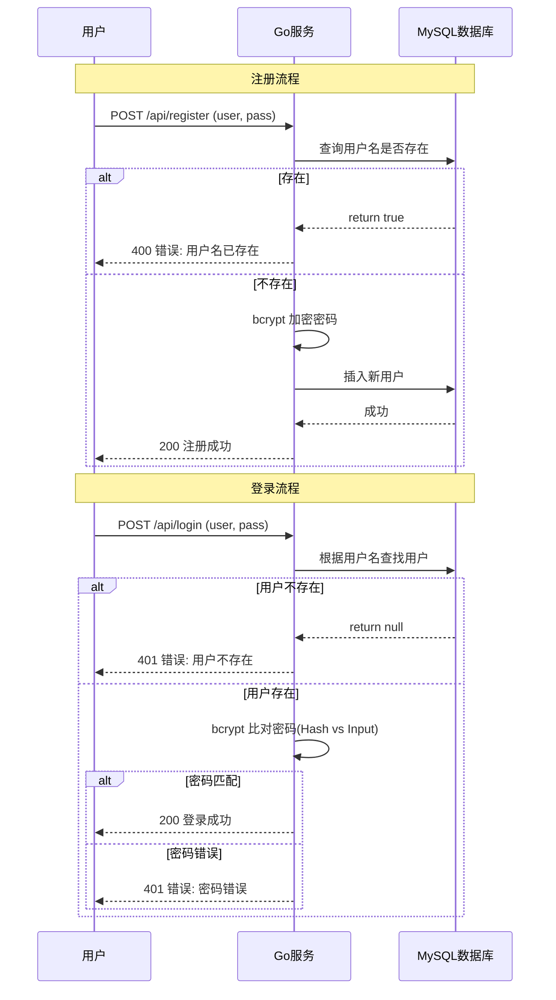

#

## 账号注册登录服务 (Go + Gin + GORM)

### 1. 简介

本需求基于 Go 语言，使用 Gin Web 框架和 GORM ORM 框架实现了基础的用户注册与登录功能。
- 数据库: MySQL 8.0
- 密码安全: 使用 bcrypt 进行加盐哈希存储

### 2. Start the procedure

1. 确保 MySQL 运行中，创建数据库 `go_login_demo`。
2. 修改 `config/db.go` 中的数据库账号密码。
3. 运行项目:
   ```bash
   go run main.go
   ```
### 业务流程图

